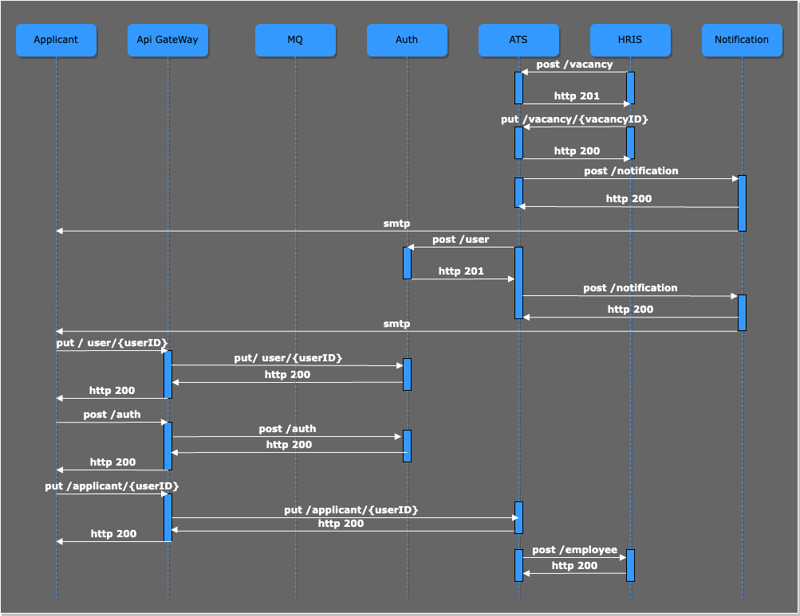

# Корпоративная система подбора и управления персоналом

Система позволяет формировать кадровые события на предприятии 

## Пользовательские сценарии
- Я как сотрудник HR могу создать кадровое событие (подбор персонала на вакансию)
- Я как сотрудник подбора могу опубликовать вакансии на внешних площадках
- Я как кандидат могу получить уведомление о приглашении на собеседование
- Я как кандидат могу получить уведомление с оффером и приглашением на регистрацию в системе ATS
- Я как кандидат могу зарегистрироваться в системе ATS
- Я как кандидат могу авторизоваться в системе ATS
- Я как кандидат могу заполнить анкету в системе ATS

## Общая схема взаимодействия сервисов

---
### Сервис «Auth»

**Назначение**

Сервис предоставляет API для работы с пользователями: регистрация, аутентификация и обновление информации о пользователях

**Команды**

- `POST /api/v1/user/` — создание нового пользователя
- `PUT  /api/v1/user/{userID}` — обновление информации о пользователе
- `POST /api/v1/auth/` — аутентификация

---
### Сервис «ATS»

**Назначение**
Applicant tracking system. Сервис предоставляет API для работы c заявками на подбор персонала, анкетами кандидатов.

**Команды**

- `POST /api/v1/vacancy/` — создание заявки на подбор персонала
- `PUT /api/v1/vacancy/{vacancyID}` — обновление информации о вакансии
- `PUT /api/v1/applicant/{userID}` — обновление информации в анкете кандидата

**Зависимости**

- Вызывает метод создания нового пользователя в сервисе Auth `POST /api/v1/user/` при формировании оффера

---

### Сервис «HRIS»

**Назначение**

Human Resource Information System. Сервис предоставляет API для совершения кадровых событий (прием, увольнение, смена назначения)

**Команды**

- `POST /api/v1/employee/` — создание сотрудника в кадровой системе

---

### Сервис «Notification»

**Назначение**

Сервис предоставляет API для работы с уведомлениями

**Команды**

- `POST /api/v1/notifications` — создание уведомления 

